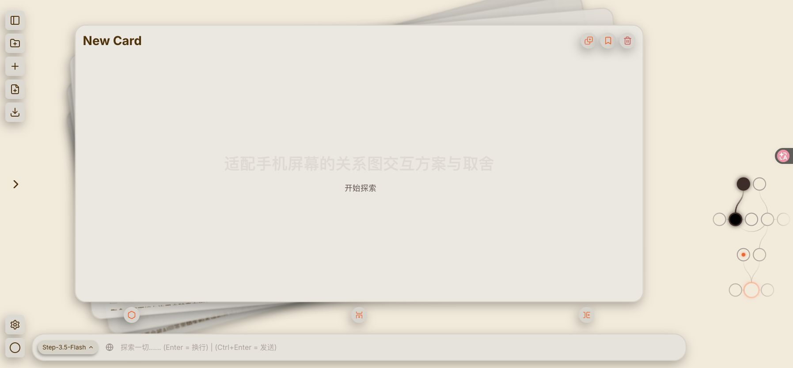
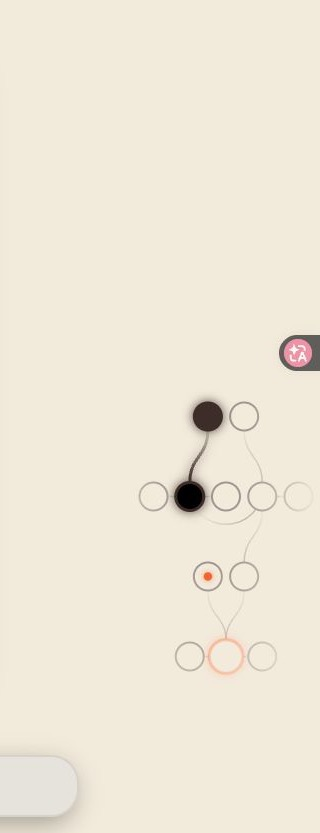
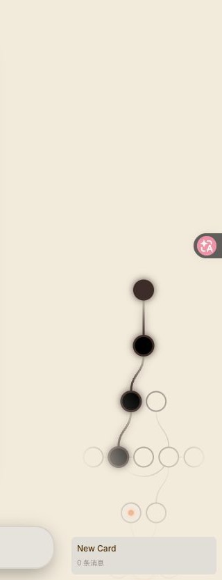
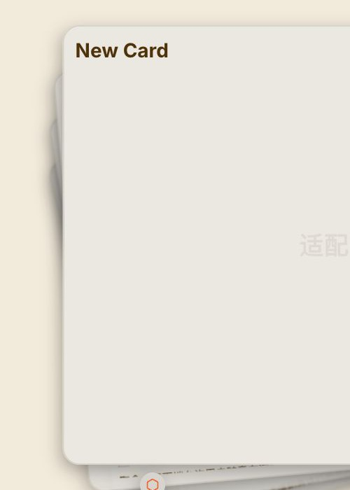

# AI Explore Poker：卡片切换与右侧关系图复核报告

复核日期：2026-08-01  
网站：https://ai.explore.poker/chat  
实测窗口：1795 × 833 像素，页面缩放 100%，Warm（温暖）主题

## 先说结论

直接看网站当前加载的前端文件是可行的，而且比只看录屏更适合确认宽度、毫秒、间距和每种卡片关系的移动方向。我又在登录后的页面上点了父节点、子节点，并新建了两张子卡，确认这些数字确实在屏幕上生效。

这次复核纠正了旧录屏报告里的两处误判：

- 当前网站的右栏展开、收起写死为 200 毫秒，节奏是开头慢、中间快、结尾慢；不是当前旧报告按录屏估出的约 300 毫秒。
- 新节点没有从父节点慢慢长出来，也没有先画线再出圆；新圆和整条线同一刻以最终大小出现，原有节点再用 200 毫秒整体让位。

旧录屏拍于 2026-07-31，当前网站检查于 2026-08-01。两者冲突时，本报告按当前在线版本写；如果要复刻旧录屏当时的版本，仍应保留旧逐帧截图单独参考。

## 1. 右栏展开和收起

### 用户看到什么、点哪里会怎样

- 当前 1795 像素宽的窗口里，右侧关系图展开后占 225 像素，收起后保留 56 像素。窗口窄于 1080 像素但仍用桌面布局时，宽栏会改成 200 像素。
- 页面刚打开时右栏默认展开并固定住。点右栏空白处会收起；收起后把鼠标移进窄条会再次展开。
- 只是悬停展开而没有点一下固定时，鼠标离开后会等 3 秒再收起，用户有时间把鼠标移回去，不会刚离开一丁点就猛地合上。
- 宽栏和窄条之间的移动用 200 毫秒完成，开头慢、中间快、结尾慢。没有弹簧回弹，也没有故意冲过头再回来。
- 卡片区域和右栏同时改宽：右栏从 56 变成 225 时，卡片区域同步少 169 像素；反过来则同步多 169 像素。右栏是真正占位置，不是盖在卡片上。
- 关系图内部保留自己的完整画布，收起时只是用 56 像素宽的窗口把多余部分藏住，不把节点重新挤成一条变形的树。

### 分界线和背景

- 卡片区和关系图之间没有竖线、边框或阴影。右栏自身是透明的，直接露出页面同一块暖米色背景。
- Warm 主题的页面底色实测是 RGB(242, 234, 219)，也就是 #F2EADB。放大关系图时底色不换白。
- 图的四周还加了一层柔和遮罩：中心最清楚，越靠边越淡，最外缘完全融进背景。它靠淡出分区，不靠硬线分区。

证据：code-verified-wide-graph.jpg、code-verified-graph-boundary.jpg。

## 2. 节点怎么排、不同关系往哪走

### 排布是不是故意错落

- 不是。节点是严格排齐的，甚至比一般流程图还规整。
- 桌面右栏里，上下层中心距离固定为 80 像素；同一层相邻节点中心距离固定为 36.25 像素。
- 同级节点的高度完全相同，实测高度差为 0 像素，没有 2～3 像素随机错落。
- 普通节点是半径 14 像素的完美正圆，也就是直径 28 像素；根节点半径 16.8 像素，也就是直径 33.6 像素。没有双线、歪圈或手绘毛边。

### 三种关系的方向

- 子卡片向上长，每深入一层向上 80 像素。
- 发散卡片留在同一层，排在来源卡片右边。
- 分支卡片也留在同一层，排在来源卡片左边。
- 手机横向关系图会把这套方向旋转：子卡向右，分支在上，发散在下。

### 颜色是不是按关系类型分

- 不是。颜色只表示“现在在哪、是不是当前路径、有没有悬停、有没有未读”，不表示子卡、发散或分支。
- Warm 主题普通圆：米色填充 #F2EADB、暖灰描边 #A09691、描边 2 像素。
- 当前圆：深棕色 #3C2D28 实心，描边 2 像素，外加约 5 像素的软光晕。
- 当前路径上的圆：深棕色描边 3 像素，并带同色软光晕。
- 根节点：珊瑚色半透明描边 3 像素，并带约 4 像素软光晕。
- 未读提示是圆心里一个半径为外圆 30% 的橙色小点；从未读变已读时，小点用 300 毫秒缩小并淡出。当前卡停留 5 秒后会自动标成已读。

证据：030-graph-six-node-crop.png、031-graph-six-node-enlarged.png、code-verified-after-two-new-nodes-graph.jpg。

## 3. 新节点到底怎么“长”

我在当前项目里连续新建了两张子卡，关系图节点从 12 个变成 14 个；没有删除原项目或原卡片，新卡已留在项目里。

### 点下新建以后

- 新圆直接出现在最终位置，第一帧就是直径 28 像素、完全看得见，没有从小到大、没有淡入、没有从父节点位置飞过去。
- 新连线和新圆同一刻出现，第一帧就是完整线段，没有像拿笔一样从父节点画过去。
- 新圆和新线之间没有先后顺序，也没有一颗一颗错开出现。
- 真正在动的是原来的整棵树：为了把新当前节点留在视野中心，旧节点整体移动一层，也就是 80 像素；这段移动用 200 毫秒，开头慢、中间快、结尾慢。
- 第二次新建时，根节点的目标高度从 736.5 变成 816.5。屏幕实测依次经过约 760.7、795.6、812.4、816.2、816.5 像素，约 223 毫秒落稳；网站自己写的目标时长是 200 毫秒，23 毫秒差异来自取样间隔和浏览器绘制。
- 同一时间，大卡片用另一套 350 毫秒动作：新卡从画面上方、放大到 120%、完全透明的状态往中间落下，逐渐缩回 100%并显现；老卡同时向后压进纸堆。

所以普通用户会觉得“新东西长出来了”，但关系图本身并没有精细的节点生长动画。柔和感主要来自旧树让位和大卡片落下。

证据：code-verified-after-two-new-nodes.jpg、code-verified-after-two-new-nodes-graph.jpg。

## 4. 点节点跳卡，以及卡片怎么切换

### 关系图的镜头

- 点任意节点后，关系图会把被点中的圆平滑移到可视区中心，不是瞬移。
- 网站没有给这段镜头写一个固定毫秒数，而是交给浏览器自己的平滑滚动处理；页面只在 500 毫秒后解除“正在自动移动”的保护。因此精确总时长没测出来，不能硬写成 300 或 500 毫秒。
- 当前节点的深棕实心状态会在 200 毫秒内过渡，主要变化是填色、描边粗细和光晕，不是把圆放大。
- 我实测从深层节点点回根节点后，关系图最后把当前圆放在横向和纵向中心；自动点击工具会先替目标滚进视野，污染了逐毫秒数据，所以镜头的精确毫秒明确记为“没测出来”。

### 卡片不是硬切，而是按关系决定从哪边飞

每一步卡片动作都是 350 毫秒，开头慢、中间快、结尾慢：

- 进入已有子卡：新卡从中心略偏右上方出现，初始放大到 120%、顺时针歪 5 度并完全透明，然后落正、缩回 100%、变清楚；老卡退到纸堆下面。
- 回到父卡：当前子卡向右上飞走并淡出，下面那张父卡同时转正、放大、变清楚，顶上来接住位置。
- 去发散卡：旧卡堆向左飞走，新卡从右边进入。
- 从发散卡回来源卡：旧卡向右飞走，来源卡从左边回来。
- 去分支卡：新分支卡从下方进入，不属于新路径的旧卡向上飞走。
- 从分支卡回来源卡：分支卡向下飞走，来源路径从上方回来。
- 上面四条说的是切换到已经存在的卡；第一次新建发散卡或分支卡时，新卡仍先挂在画面上方，以 120% 大小和全透明状态落入，再由旧卡向左或向上退场。
- 跳到毫无关系的卡：旧卡缩小到 95%并淡掉，再换新卡。
- 一次跳过很多层时不会整页瞬间换掉。连续同方向的中间卡会一张接一张穿过画面，每张相差 50 毫秒，形成“翻一沓纸”的感觉。

### 卡片叠放的准确样子

当前 1795 × 833 窗口里：

- 当前卡是 1286.9 × 628.2 像素，圆角 24 像素，边框 2 像素，阴影向左 4 像素、向下 8 像素扩散到 24 像素。
- 上一张卡中心向左错约 16.1 像素、向下错约 0.7 像素，逆时针转 5 度，缩到 96%，模糊 0.5 像素，亮度 95%，透明度 90%。
- 上上张向左约 32.1 像素、向下约 2.8 像素，逆时针转 10 度，缩到 92%，模糊 1 像素，亮度 90%。
- 第三张向左约 47.8 像素、向下约 6.3 像素，逆时针转 15 度，缩到 88%，模糊 1.5 像素，亮度 85%。
- 每往后一张都再少 4% 大小、再歪 5 度、再模糊 0.5 像素、再暗 5%，并压低一层。
- 后面的卡虽然露出纸边，但不能点；实测它们都不接收鼠标。回上一张必须点关系图节点或对应操作，不能点露出的纸边退回。

证据：code-verified-card-stack-left.jpg。

## 5. 拖动和悬停

### 拖动手感

- 按住空白处时鼠标从张开的手变成抓紧的手。
- 图跟鼠标一比一移动，手走多少，图就走多少，没有额外加速。
- 松手立即停止，没有惯性滑行、没有弹簧回弹、没有节点视差。
- 每次手动滚动或拖动后，页面会等 3 秒；如果用户没有继续操作，再平滑把当前节点拉回中心。这不是松手惯性，而是延迟三秒的自动归位。

### 悬停反馈

- 悬停普通节点时，圆本身不放大；描边从 2 像素过渡到 4 像素，变成珊瑚色，并加一圈约 6 像素的光晕，过程 200 毫秒。
- 右栏底部同时出现一张小提示条，显示卡片标题和消息条数。225 像素宽栏里，提示条左右各留 8 像素，实测约 209 × 54 像素，圆角 6 像素。
- 悬停当前节点时，因为它已经是当前色，不会再换成珊瑚色，但同样会出现标题和消息数提示条。

证据：code-verified-after-two-new-nodes-graph.jpg。

## 6. 连线怎么画

- 父子关系不是直线。它是一条柔和曲线，从父圆上沿出发，到子圆下沿结束；上下层相距 80 像素，弯曲的转折控制在两层正中间约 40 像素处。
- 发散和分支在同一层。如果目标紧挨来源，直接用短直线；中间隔着其他节点时，改用圆弧绕过去。
- 跨得越远，圆弧半径也跟着变大，不是一条固定弧度硬套所有距离。
- 普通线宽 1.5 像素，当前路径线宽 3 像素并带软光晕。
- 线从来源端较实，朝目标端逐渐淡到约 15%；当前路径来源端最实，普通关系来源端约 95%。
- 所有线都没有箭头，关系类型也不靠线条颜色区分。

证据：031-graph-six-node-enlarged.png、code-verified-after-two-new-nodes-graph.jpg。

## 7. 为什么它不僵硬

节点其实“死对齐”，新节点甚至是直接出现。它看起来仍不像生硬流程图，主要靠这些东西叠加：

- 卡片区和图栏没有竖线，共用 #F2EADB 暖米色底。
- 图的边缘不是裁一刀，而是逐渐淡进背景。
- 普通点和线对比度很低，当前路径才变深并发光。
- 卡片本身有 24 像素圆角和偏向左下的宽软阴影，后面的纸逐层歪、缩、暗、糊。
- 右栏只用 200 毫秒轻快让位，卡片切换则用 350 毫秒做方向明确的飞入飞出。
- 手动拖动没有花哨物理效果，只在 3 秒无操作后把当前点温和拉回中心。

## 8. 失败操作和没测出来的项

- 自动点击收起后，鼠标仍停在 56 像素窄条里，会立刻触发悬停再展开，所以这次没有产出一套新的可靠收起逐帧图；200 毫秒、56/225 像素和移动节奏来自当前页面自己写死的数值，并由现有旧录屏确认“确实是平滑移动”。
- 点远处节点时，自动点击工具会先把目标滚进可视区，污染镜头逐毫秒数据；因此只确认“平滑居中”和“500 毫秒保护”，精确滚动总时长写“没测出来”。
- 当前网站随时可能更新。本文数字对应 2026-08-01 登录后实际加载的在线版本。

## 9. 照抄清单

- 桌面右栏做 225 像素宽、收起留 56 像素；小桌面宽栏改 200 像素。
- 展开和收起都用 200 毫秒，开头慢、中间快、结尾慢，并让卡片区域同步让出或收回 169 像素。
- 右栏真实占位置，不要浮在卡片上；内部画布保持完整，收起只裁掉超出窄条的部分。
- 删除卡片与右栏之间贯穿全高的竖线、边框和阴影，两边统一使用 #F2EADB 暖米色背景。
- 给关系图四周加从清楚到透明的柔和淡出，让节点和线融进页面，不要用硬切边界。
- 节点严格排齐：上下层中心距 80 像素，同层相邻中心距 36.25 像素，不加随机抖动。
- 普通节点做 28 像素正圆、2 像素暖灰边；根节点做 33.6 像素、3 像素半透明珊瑚边。
- 当前节点做 #3C2D28 实心圆和 5 像素软光晕；当前路径线和圆加深，不按关系类型染不同颜色。
- 子卡向上、发散向右、分支向左；手机横向图则子卡向右、分支向上、发散向下。
- 父子线用柔和曲线，同层相邻关系用短直线，跨过其他节点时用随距离变大的圆弧；普通线 1.5 像素、当前路径 3 像素、全部无箭头。
- 线从来源端约 95% 强度淡到目标端 15%，不要整根线一样黑。
- 忠实复刻时，新节点和新线直接以最终大小一起出现，不做缩放、淡入或画线动画；只让原有节点用 200 毫秒整体移动 80 像素腾位置。
- 新建子卡时，大卡片从上方以 120% 大小和全透明状态落入，用 350 毫秒缩正并显现。
- 卡片切换统一 350 毫秒：子卡走右上、发散走左右、分支走上下、无关卡淡出；跨多层的中间卡每张错开 50 毫秒。
- 卡片纸堆每深一层向左约 16 像素、逆时针再转 5 度、再缩小 4%、再模糊 0.5 像素、再暗 5%。
- 后卡只露纸边但不能点，返回靠关系图节点，不要把露边做成返回热区。
- 拖动保持一比一跟手，松手无惯性、无回弹、无视差；停止操作 3 秒后再平滑把当前节点拉回中心。
- 节点悬停不放大，只在 200 毫秒内把描边加粗到 4 像素、变珊瑚色并发光，同时在栏底显示标题和消息数。
- 点节点后用浏览器平滑滚动把它放到中心，并在约 500 毫秒内不要用别的自动动作抢镜头。
